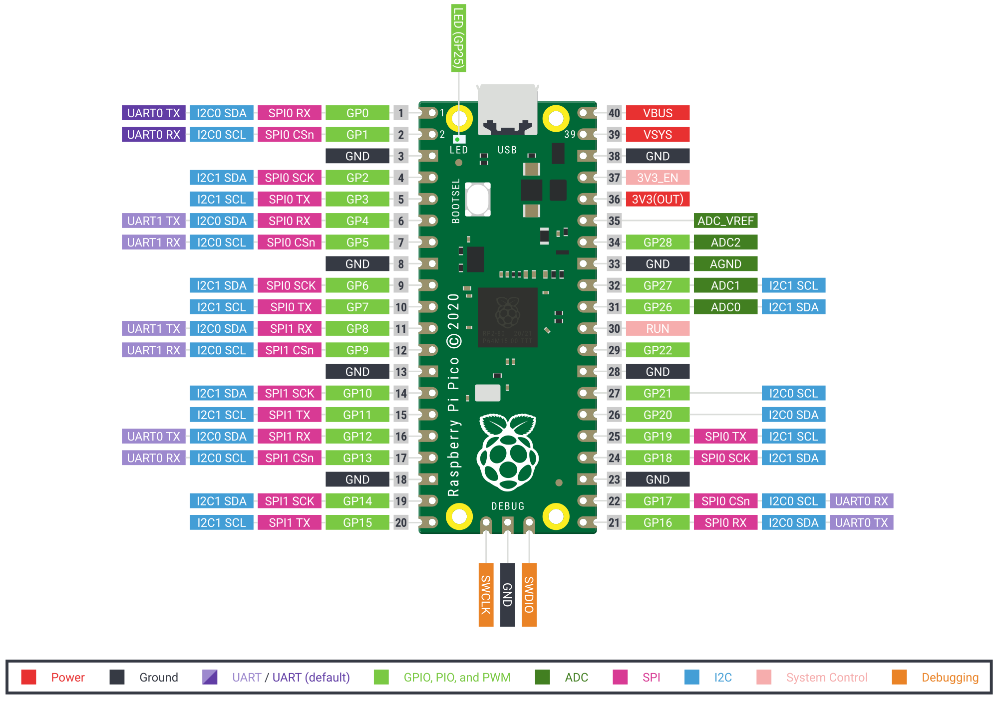

# pico-store
Project to keep updated documents, tools and wiki for Raspberry Pi Pico RP2040 based Board.

## Raspberry Pi Pico rev3

## License

All materials are Licensed under the [BSD-3-Clause License](LICENSE) unless
otherwise specified. 
Certain materials are part public release under 
[Raspberry Pi Foundation License agreements](https://www.raspberrypi.org/documentation/pico/getting-started/).